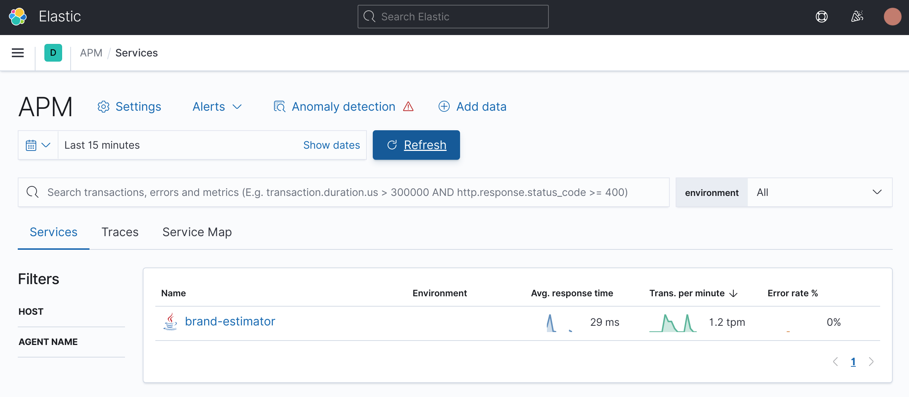
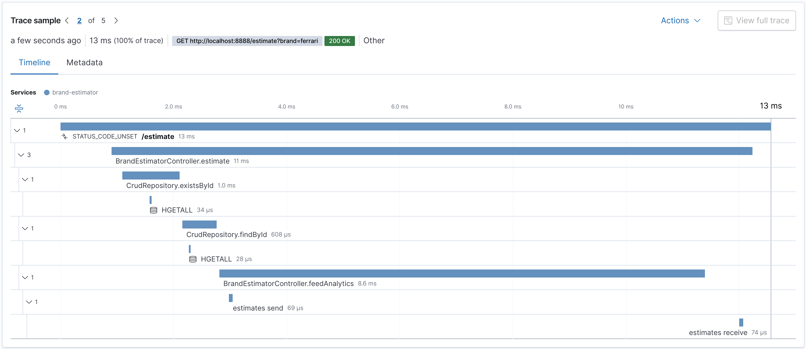

# OpenTelemetry with Apache Pulsar

This repository contains an example of application that offers users a way to estimate the cost of certain car brands. When a brand is provided the application queries the estimative in a [Redis](https://redis.io) database. Along with the operation to estimate, the application also produces and consumes events to and from [Apache Pulsar](https://pulsar.apache.org). This whole transaction is captured using [OpenTelemetry](https://opentelemetry.io) and sent to [Elastic APM](https://www.elastic.co/apm).



By using Elastic APM folks from Ops gain instant insight about transactions, granting them a way to pragmatically observe when the transaction becomes unavailable or when it contains bottlenecks. More importantly, it allows them to know exactly where in the transaction is the problem. Here is an example of the timeline from the application aforementioned.



As you can see in the timeline above, as part of the `estimate` operation there is a step that feeds the analytics platform currently implemented using Pulsar. The child operations `estimates send` and `estimates receive` represent the usage of producers and consumers from Pulsar in the code — that write and read messages in a topic called `estimates`.

This is the part that this repository aims to address. Because OpenTelemetry currently has no official support for Pulsar the usage of Pulsar APIs in this application would create "black holes" in the transaction, which then compromises the Ops team ability to diagnose for example — when the producer or the consumer from Pulsar could be affecting the transaction's availability or performance.

To address this problem custom instrumentation for Pulsar was created.

## Pre-requisites

The following software must be correctly installed in the machine to run this example.

<table>
  <tr border="1">
    <td>Docker</td>
    <td><a href="https://www.docker.com/docker-community">https://www.docker.com/docker-community</a></td>
  </tr>
  <tr border="1">
    <td>Docker Compose</td>
    <td><a href="https://docs.docker.com/compose">https://docs.docker.com/compose</a></td>
  </tr>
</table>

## Getting started

Open a new terminal and execute the following steps:

#### 1. Clone the repository

```bash
git clone https://github.com/riferrei/otel-with-apache-pulsar.git
```

#### 2. Start the microservice

```bash
docker-compose up -d
```

#### 3. Execute HTTP requests

```bash
curl -X GET http://localhost:8888/estimate?brand=ferrari
```

## Playing with Elastic APM

Open a browser and go to the follwing URL:

```bash
http://localhost:5601/app/apm
```

# License

This project is licensed under the [Apache 2.0 License](./LICENSE).